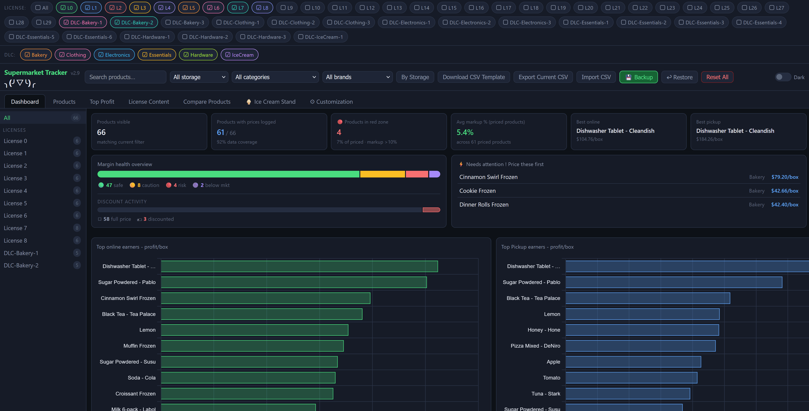

# Supermarket Simulator Profit Tracker + Auto Sync

Неофициальный трекер прибыли для [Supermarket Simulator](https://store.steampowered.com/app/2670630/Supermarket_Simulator/). Он помогает сравнивать закупочные и продажные цены, считать прибыль и переносить данные из сохранения игры в браузерный трекер. Для автоматического чтения сохранений есть отдельный помощник для Windows.



## Возможности

- Автоматический поиск и **чтение сохранения игры без записи в него**. Помощник не меняет сохранения, файлы игры и процесс игры.
- Режимы **«Проверить изменения»**, **«Автосинхронизация»** и **«Отменить последнюю синхронизацию»**. Перед первым применением можно просмотреть каждое изменение.
- Отдельный учёт цены поставщика за единицу, стоимости коробки, средней себестоимости запасов, рыночной цены, цены продажи игрока и цены закупки самовывозом. Стоимость коробки рассчитывается по данным игры.
- Проверенное сопоставление товаров по ProductID и отображение статуса товара в игровом списке: активен, отключён или статус неизвестен.
- Настраиваемый минимальный порог прибыли с коробки и фильтры товаров.
- Полный интерфейс на русском и английском. При наличии совместимых файлов игры помощник показывает официальные русские названия товаров.
- Импорт и экспорт CSV, а также полная резервная копия в JSON с товарами, историей цен и настройками.
- Возможность пользоваться исходным HTML-трекером вручную, без помощника.

## Как скачать и запустить

Скачайте **SupermarketTrackerSync.exe** из GitHub Release проекта. 

Помощник рассчитан на **Windows x64**. Сборка содержит всё необходимое: пользователю не нужно отдельно устанавливать .NET, Python или Node.js. Права администратора не требуются.

1. Закройте ранее запущенную версию помощника, если она есть.
2. Дважды щёлкните `SupermarketTrackerSync.exe`. Трекер откроется по адресу **http://127.0.0.1:47831/**.
3. Проверьте выбранное сохранение в блоке Game Sync. Если найдено несколько слотов, помощник предложит самый новый.
4. В режиме **«Проверить изменения»** просмотрите предложенные цены и соответствия товаров. Перед применением скачайте полную резервную копию.
5. При желании включите **«Автосинхронизация»** после отдельного подтверждения. При смене слота, несовместимом сохранении или большом числе изменений она приостановится до проверки.

Чтобы указать конкретный слот, запустите EXE из PowerShell:

```powershell
.\SupermarketTrackerSync.exe --save "<полный путь к файлу slot_0.es3>"
```

Помощник принимает подключения только на `127.0.0.1`. Его состояние можно посмотреть по адресу [http://127.0.0.1:47831/status](http://127.0.0.1:47831/status). Изменения цен, история и настройки хранятся в браузере; в сохранение игры они не записываются.

## Перенос данных и резервные копии

У страницы, открытой как `file://`, и страницы `http://127.0.0.1:47831/` разные хранилища браузера. Чтобы перенести прежние данные:

1. В старом трекере откройте **«Резервное копирование → Скачать резервную копию»** (Backup → Download Backup).
2. Откройте трекер через помощника по адресу `http://127.0.0.1:47831/`.
3. Выберите **«Резервное копирование → Восстановление»** (Backup → Restore) и укажите скачанный JSON.

Разные браузеры и порты тоже используют разные хранилища. Экспорт CSV не включает всю историю цен и настройки, поэтому для переноса нужна именно полная резервная копия JSON. Сделайте её перед очисткой данных браузера.

## Ручной режим без помощника

Откройте [supermarketSimulator-tracker_v2_9.html](supermarketSimulator-tracker_v2_9.html) в современном браузере. Если копируете HTML в другую папку, скопируйте вместе с ним каталог [src](src), сохранив относительный путь к нему. Для Game Sync и официальных игровых названий товаров используйте страницу, которую открывает помощник на localhost.

## Совместимость и ограничения

Помощник проверен с форматом сохранения Supermarket Simulator `v1.6.0(223)`. Сопоставление ProductID и каталог локализации подготовлены для этой версии игры. После обновления игры неизвестный формат или товар могут потребовать новой проверки: помощник может запретить применение изменений, а названия товаров переключить на английские. Не назначайте соответствие неоднозначному товару без проверки.

Исходный трекер загружает диаграммы и шрифты через CDN, поэтому для их отображения может потребоваться интернет.

## Если что-то не работает

- **Помощник недоступен:** запустите EXE, проверьте адрес `http://127.0.0.1:47831/` и закройте старую копию помощника.
- **Сохранение не найдено:** сохраните игру хотя бы один раз; при необходимости укажите слот через `--save`.
- **Синхронизация приостановлена:** откройте «Проверить изменения» и изучите ошибки чтения или сопоставления.
- **После перехода на localhost пропали прежние цены:** восстановите полную JSON-копию из старого браузерного хранилища.
- **Нет русских названий товаров:** проверьте установленную игру командой `SupermarketTrackerSync.exe --inspect-localization`.

Журнал помощника находится в `%LOCALAPPDATA%\SupermarketTrackerSync\logs\helper.log`. В нём могут быть локальные пути к сохранениям: перед публикацией журнала удалите личные данные. Подробнее: [синхронизация с игрой](docs/game-sync.md), [локализация](docs/localization.md), [решение проблем](docs/troubleshooting.md).

## Сборка и тесты

Для разработки нужны .NET 8 SDK, Node.js и Python. Локальная релизная сборка:

```powershell
dotnet publish src/SupermarketTrackerSync/SupermarketTrackerSync.csproj -c Release -r win-x64 --self-contained true -p:PublishSingleFile=true -p:IncludeNativeLibrariesForSelfExtract=true -o dist/SupermarketTrackerSync-1.0.0
```

Каталог `dist/` исключён из Git. Релизный каталог должен содержать только EXE. Автоматические тесты находятся в [tests](tests), а инструменты поддержки ProductID и локализации — в [tools](tools).

## Авторы и лицензия

Проект основан на [Erebes666/supermarket-simulator-profit-tracker](https://github.com/Erebes666/supermarket-simulator-profit-tracker). Исходный трекер, CSV, изображения, лицензия MIT и уведомление об авторских правах Erebes666 сохранены в [LICENSE](LICENSE). Auto Sync и локализация развивают этот проект.

Это неофициальный фанатский проект. Он не связан с Nokta Games и не одобрен компанией. Название Supermarket Simulator и игровой контент принадлежат их правообладателям.
